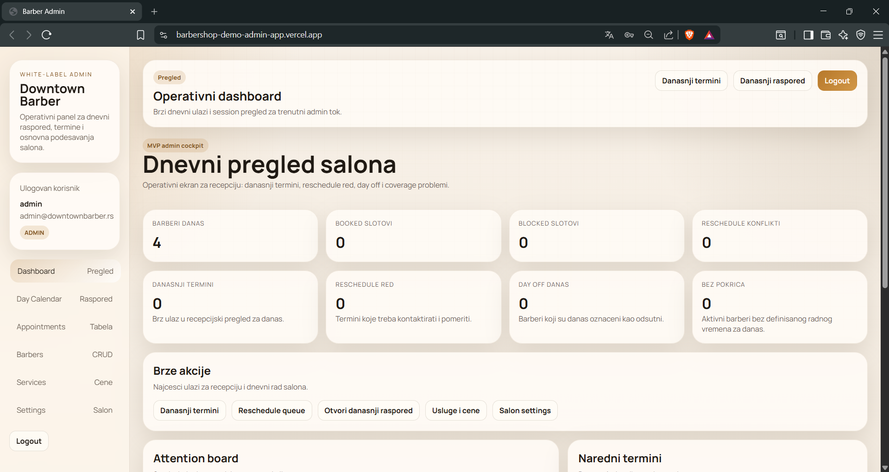
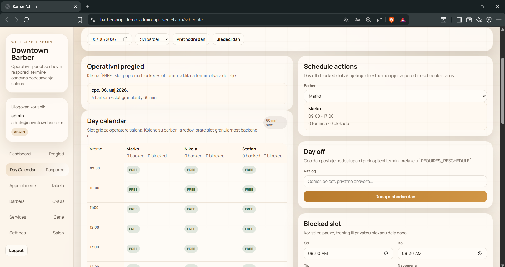
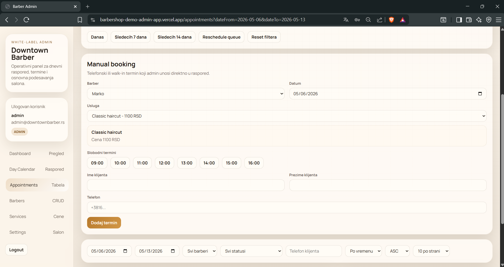
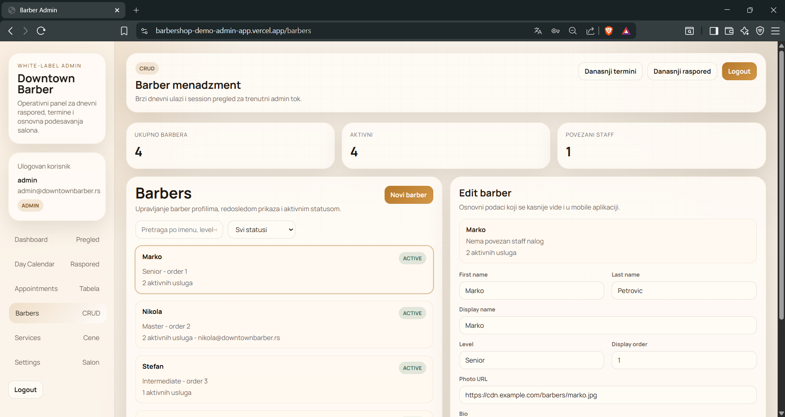
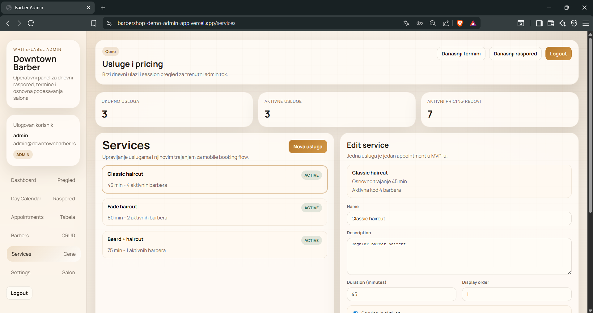
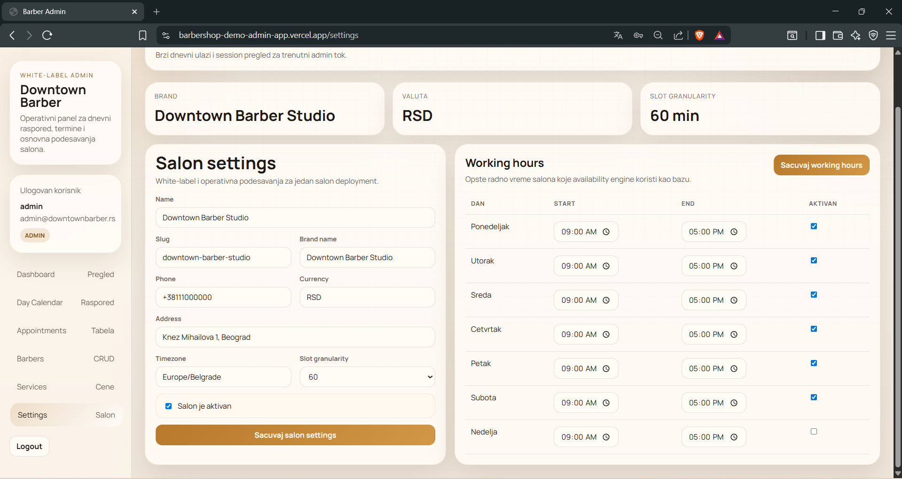

# Barber Booking Admin Dashboard

Admin dashboard for a white-label barber booking platform, built for salon owners, reception/admin staff, and barbers.

This repository is one part of a larger product suite:
- `admin-web` - salon/admin dashboard
- `backend` - NestJS booking API
- `mobile-app` - customer-facing Flutter app

## Project Summary

This application is the operational control panel for a barber salon.

It enables salon staff to:
- monitor the daily schedule
- manage appointments
- handle rescheduling flows
- create manual bookings
- configure barber availability
- maintain salon settings, services, and pricing

The UI is designed around real salon workflows rather than just CRUD forms.

## Core Features

- Staff login flow
- Dashboard with operational overview
- Day calendar by barber and slot
- Week schedule overview
- Appointment table with filters, sorting, and pagination
- Appointment detail panel
- Manual booking flow
- Day off and blocked slot management
- Reschedule flow for conflicting appointments
- Barber management
- Service and pricing management
- Salon settings and working hours management
- Confirm modal and toast feedback UX

## UX / Product Highlights

- Schedule and appointments are connected, not isolated
- `REQUIRES_RESCHEDULE` flows are visible and actionable
- Free slots in the day calendar can trigger operational actions
- Destructive actions use confirmation steps
- The dashboard acts as an operator cockpit, not just a landing page

## Tech Stack

- Next.js
- React
- TypeScript
- Fetch-based API client
- Custom admin design system / CSS styling

## Main Screens

- Login
- Dashboard
- Day Calendar
- Appointments
- Barbers
- Services
- Settings

## Local Development

### Requirements

- Node.js 20+
- npm
- running backend API

### Environment Setup

Copy:

```bash
cp .env.example .env.local
```

Set:

```env
NEXT_PUBLIC_API_BASE_URL=http://localhost:3000
```

### Run Locally

```bash
npm install
npm run dev
```

Default local URL:

- `http://localhost:3001`

## Build and Type Check

```bash
npm run build
npm run lint
```

## Demo Credentials

- `admin@downtownbarber.rs` / `Admin123!`
- `nikola@downtownbarber.rs` / `Barber123!`

## Deployment Notes

This app is set up well for platforms such as Vercel.

Current demo deployment stack:
- admin dashboard deployed on `Vercel`
- backend API deployed on `Render`
- PostgreSQL database hosted on `Supabase`

Required production environment variable:

```env
NEXT_PUBLIC_API_BASE_URL=https://your-backend-url
```

This makes the admin panel easy to showcase as a live hosted product during demos and sales conversations.

## Screenshots

Current admin dashboard preview:








## What This Project Demonstrates

This repository is good portfolio/CV material for:
- admin panel UX design
- operational workflow design
- calendar-based schedule interfaces
- frontend integration with a custom backend API
- building product-focused tools instead of generic dashboards

## Related Repositories

This admin dashboard is intended to be presented together with:
- the backend API repository
- the customer mobile app repository
